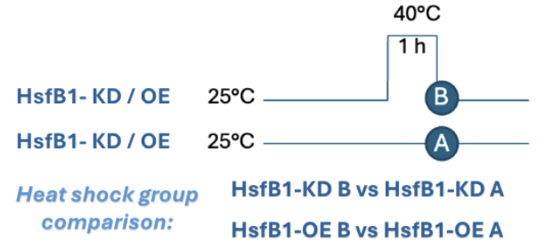

# Introduction

Heat stress is a major environmental challenge that affects the growth and productivity of tomato (Solanum
lycopersicum). When exposed to high temperatures, plants rapidly activate a network of heat shock factors (HSFs) and
heat shock proteins (HSPs), which together promote thermotolerance. Understanding the function of these regulatory genes
is crucial for developing crops with improved resilience to heat stress.

In this study, tomato plants were subjected to control conditions (25°C) and heat stress (40°C for 1 hour), using lines
in which HsfB1 was either knocked down (KD) or overexpressed (OE). This experimental setup allows investigation of the
role of HsfB1 in regulating heat-responsive genes and cellular processes under stress conditions.

HsfB1 encodes a heat shock transcription factor that functions both as a repressor and a co-activator in the plant heat
stress response . In tomato, HsfB1 can either repress or facilitate the expression of downstream heat shock genes,
working alongside master regulators such as HsfA1a and co-activators like HsfA2. Knockdown (KD) of HsfB1 allows
identification of cellular processes that require HsfB1 for activation under heat stress, while overexpression (OE)
reveals whether an increased supply of HsfB1 is sufficient to enhance or modify the heat shock response.

{fig-align="center" width="60%"}

# Sample distances

```{r}
library(DESeq2)
library(ggplot2)
library(dplyr)
library(pheatmap)
library(RColorBrewer)
library(ggrepel)
library(reshape2)
library(knitr)
library(tidyr)
```

## HsfB1 KD B vs.A

### Heatmap of pairwise sample distances

```{r}
# Load count folders and extract count files 
mydir_kd_BvA <- "/Users/ngocdiep/F1 RNAseq/data_count_tables_from_featureCounts/"  
myfile_kd_BvA <- list.files(path = mydir_kd_BvA, pattern = "HSFB1_KD_B|HSFB1_KD_A") 

#create a function that extracts the GeneID and merges the count columns for each sample
get_gene_counts_kd_BvA <- function(file){
  df = read.table(file, header = TRUE) #read the featureCounts output into  a data frame
  df<- df %>% dplyr::select(-gene_name) #keep only the 'gene_id' and 'count' column
  sampleName = sub(".txt", "", file) #remove .txt from the file name 
  colnames(df) = c("Geneid", sampleName)
  return(df)
}

#apply the custom get_gene_counts() function to each sample file
countData_kd_BvA <- purrr::map(paste0(mydir_kd_BvA, myfile_kd_BvA), get_gene_counts_kd_BvA)

#join all dataframe together
countData_kd_BvA <- purrr::reduce(countData_kd_BvA, inner_join) 

#add Geneid to the row name 
row.names(countData_kd_BvA) <- countData_kd_BvA$Geneid 

#delete Geneid column name for DEseq
countData_kd_BvA$Geneid <- NULL 

#change column name
names(countData_kd_BvA) = c(paste("HSFB1_KD_A_rep", c(1:3), sep="_"),
                     paste("HSFB1_KD_B_rep", c(1:3), sep="_")) 

# make colData to indicate the sample and conditions
colData_kd_BvA <- data.frame(condition = factor(rep(c("HSFB1_KD_A", "HSFB1_KD_B"), each = 3)), 
              replicate = factor (rep(paste("rep", 1:3, sep = "_"),2)))

#create DESeqDataSet object 
dds_kd_BvA <- DESeqDataSetFromMatrix(countData = countData_kd_BvA,
                              colData = colData_kd_BvA,
                              design= ~condition)

# set "control" as reference condition.
dds_kd_BvA$condition <- relevel(dds_kd_BvA$condition, ref = "HSFB1_KD_A")
```

```{r}
# run DESeq2 analysis
dds_kd_BvA <- DESeq(dds_kd_BvA)

#save dds_kd_BvA object
#saveRDS(dds_kd_BvA,"/Users/ngocdiep/F1 RNAseq/homework/dds_KD_BA.rds" )

# r-log transform data
rld_kd_BvA <- rlog(dds_kd_BvA, blind=T)

# Extract and Transpose Transformed Count Data
sampleDists_kd_BvA <- dist(t(assay(rld_kd_BvA)))
sampleDistMatrix_kd_BvA <- as.matrix(sampleDists_kd_BvA)

# add row and column names for matrix labels
rownames(sampleDistMatrix_kd_BvA) <- paste(rld_kd_BvA$condition, rld_kd_BvA$replicate, sep="-")
colnames(sampleDistMatrix_kd_BvA) <- rownames(sampleDistMatrix_kd_BvA)

# define colour gradient
colors <- colorRampPalette( rev(brewer.pal(9, "Oranges")) )(255)

# create heatmap
pheatmap(sampleDistMatrix_kd_BvA, 
         clustering_distance_rows=sampleDists_kd_BvA,
         clustering_distance_cols=sampleDists_kd_BvA, 
         col=colors, 
         angle_col = 90)
```

Heatmap clustering of HsfB1-KD samples under B and A conditions shows that replicates form distinct clusters, reflecting
high within-condition consistency. HsfB1-KD-B exhibits greater intra-group similarity than HsfB1-KD-A.

### Principle component analysis

```{r}
# Extract PCA Data and Variance for ggplot2
pcaData_kd_BvA <- plotPCA(rld_kd_BvA, intgroup=c("condition","replicate"), returnData=TRUE)
percentVar <- round(100 * attr(pcaData_kd_BvA, "percentVar"), digits=1)

ggplot(pcaData_kd_BvA, aes(x=PC1, y=PC2, color=condition, shape=replicate)) +
  geom_point(size=3) +
  xlab(paste0("PC1: ",percentVar[1],"% variance")) + # change label x axis
  ylab(paste0("PC2: ",percentVar[2],"% variance")) + # change label y axis
  theme(aspect.ratio = 1) +
  theme_linedraw()
```

The PCA plot shows a clear separation between HsfB1-KD samples under B and A conditions, primarily along PC1, which
explains 94.9% of the variance. This suggests that the main variation is driven by differences in heat shock factor
expression.

## HsfB1 OE B vs.A

### Heatmap of pairwise sample distances

```{r}
# Load count folders and extract count files 
mydir_oe_BvA <- "/Users/ngocdiep/F1 RNAseq/data_count_tables_from_featureCounts/"  
myfile_oe_BvA <- list.files(path = mydir_oe_BvA, pattern = "HSFB1_OE_B|HSFB1_OE_A")

#create a function that extracts the GeneID and merges the count columns for each sample
get_gene_counts_oe_BvA <- function(file){
  df = read.table(file, header = TRUE)# Read the featureCounts output into  a data frame
  df<- df %>% dplyr::select(-gene_name) # Keep only the 'gene_ID' and 'count' column
  sampleName = sub(".txt", "", file) # remove .txt from the file name 
  colnames(df) = c("Geneid", sampleName)
  return(df)
}

#apply the custom get_gene_counts() function to each sample file
countData_oe_BvA <- purrr::map(paste0(mydir_oe_BvA, myfile_oe_BvA), get_gene_counts_oe_BvA)

#join all dataframe together
countData_oe_BvA <- purrr::reduce(countData_oe_BvA, inner_join) 

#add Geneid to the row name 
row.names(countData_oe_BvA) <- countData_oe_BvA$Geneid 

#delete gene_id column name for DEseq
countData_oe_BvA$Geneid <- NULL 

#change col name
names(countData_oe_BvA) = c(paste("HSFB1_OE_A_rep", c(1:3), sep="_"),
                     paste("HSFB1_OE_B_rep", c(1:3), sep="_")) 

#convert countdata into integer
countData_oe_BvA$HSFB1_OE_A_rep_3 = as.integer(countData_oe_BvA$HSFB1_OE_A_rep_3 )
countData_oe_BvA$HSFB1_OE_B_rep_2 = as.integer(countData_oe_BvA$HSFB1_OE_B_rep_2 )

colData_oe_BvA <- data.frame(condition = factor(rep(c("HSFB1_OE_A", "HSFB1_OE_B"), each = 3)), 
              replicate = factor (rep(paste("rep", 1:3, sep = "_"),2)))

#create DESeqDataSet object 
dds_oe_BvA <- DESeqDataSetFromMatrix(countData = countData_oe_BvA,
                              colData = colData_oe_BvA,
                              design= ~condition)
#save dds_oe_BvA object
#saveRDS(dds_oe_BvA,"/Users/ngocdiep/F1 RNAseq/homework/dds_OE_BA.rds")

# set "control" as reference condition using relevel() to explicitly name the reference condition.
dds_oe_BvA$condition <- relevel(dds_oe_BvA$condition, ref = "HSFB1_OE_A")
```

```{r}
# run DESeq2 analysis
dds_oe_BvA <- DESeq(dds_oe_BvA)

# r-log transform data
rld_oe_BvA <- rlog(dds_oe_BvA, blind=TRUE)

# Extract and Transpose Transformed Count Data
sampleDists_oe_BvA <- dist(t(assay(rld_oe_BvA)))
sampleDistMatrix_oe_BvA <- as.matrix(sampleDists_oe_BvA)

# add row and column names (ie. matrix labels)
rownames(sampleDistMatrix_oe_BvA) <- paste(rld_oe_BvA$condition, rld_oe_BvA$replicate, sep="-")
colnames(sampleDistMatrix_oe_BvA) <- rownames(sampleDistMatrix_oe_BvA)

# define colour gradient
colors <- colorRampPalette( rev(brewer.pal(9, "Oranges")) )(255)

# create heatmap
pheatmap(sampleDistMatrix_oe_BvA, 
         clustering_distance_rows=sampleDists_oe_BvA,
         clustering_distance_cols=sampleDists_oe_BvA, 
         col=colors, 
         angle_col = 90)
```

Heatmap clustering of HsfB1-OE samples under B and A conditions shows that replicates form distinct clusters, indicating
high within-condition consistency. HsfB1-OE-B exhibits greater intra-group similarity than HsfB1-OE-A.

### Principle component analysis

```{r}
# Extract PCA Data and Variance for ggplot2
pcaData_oe_BvA <- plotPCA(rld_oe_BvA, intgroup=c("condition","replicate"), returnData=TRUE)
percentVar <- round(100 * attr(pcaData_oe_BvA, "percentVar"), digits=1)

ggplot(pcaData_oe_BvA, aes(x=PC1, y=PC2, color=condition, shape=replicate)) +
  geom_point(size=3) +
  xlab(paste0("PC1: ",percentVar[1],"% variance")) + # change label x axis
  ylab(paste0("PC2: ",percentVar[2],"% variance")) + # change label y axis
  theme_linedraw() 

```

PC1 accounts for 92.4% of the variance, highlighting significant biological differences between HsfB1-OE-B and
HsfB1-OE-A, likely driven by heat shock factors.

# DESeq2 analysis

## Heatshock genes

```{r}
heatshock_genes <- c(HsfA1a = "Solyc08g005170", 
                     HsfA1b = "Solyc03g097120", 
                     HsfA1c = "Solyc08g076590", 
                     HsfA1e = "Solyc06g072750", 
                     HsfA2 = "Solyc08g062960", 
                     HsfA3 = "Solyc09g009100",
                     HsfA4a = "Solyc02g072000", 
                     HsfA4b = "Solyc03g006000",
                     HsfA4c = "Solyc07g055710",
                     HsfA5  = "Solyc12g098520",
                     HsfA6a = "Solyc06g053960",
                     HsfA6b = "Solyc09g082670", 
                     HsfA7 = "Solyc09g065660", 
                     HsfB4a = "Solyc04g078770",
                     HsfA8 = "Solyc09g059520",
                     HsfA9 = "Solyc07g040680",
                     HsfB1 = "Solyc02g090820",
                     HsfC = "Solyc12g007070", 
                     Hsp101 = "Solyc03g115230")
heatshock_genes <- as.data.frame(heatshock_genes)
heatshock_genes$gene.name <- rownames(heatshock_genes)
```

## Analysis of individual datasets

For each dataset, comparisons were made between condition B (heatshock) and condition A (control): HsfB1-KD-B vs.
HsfB1-KD-A and HsfB1-OE-B vs. HsfB1-OE-A. These comparisons reveal how HsfB1 knockdown or overexpression impacts the
heat shock response, particularly the expression of heat shock factors.

### HsfB1 KD B vs.A

```{r}
#Test for DEG
res_kd_BvA <- results(dds_kd_BvA, contrast=c("condition", "HSFB1_KD_B", "HSFB1_KD_A"))
# add new column with stripped gene names
res_kd_BvA$gene.name <- sub("gene:", "", rownames(res_kd_BvA)) #remove "gene:" → "Solyc00g005280.1"
res_kd_BvA$gene.name <- substr(res_kd_BvA$gene.name, 1, 14) #keep first 14 chars → "Solyc00g005280"
#convert complex dataframe DESeq into the normal one
res.df_kd_BvA <- as.data.frame(res_kd_BvA)
#save res.df_kd_BvA 
#saveRDS(res.df_kd_BvA, "/Users/ngocdiep/F1 RNAseq/homework/KD_B_A.rds")
```

### HsfB1 OE B vs.A

```{r}
res_oe_BvA <- results(dds_oe_BvA, contrast=c("condition", "HSFB1_OE_B", "HSFB1_OE_A"))
res_oe_BvA$gene.name <- sub("gene:", "", rownames(res_oe_BvA))
res_oe_BvA$gene.name <- substr(res_oe_BvA$gene.name, 1, 14)
#convert complex dataframe DESeq into the normal one
res.df_oe_BvA <- as.data.frame(res_oe_BvA)
#save res.df_oe_BvA 
#saveRDS(res.df_oe_BvA, "/Users/ngocdiep/F1 RNAseq/homework/OE_B_A.rds")

```

# Visualization

## Count plots of HsfB1

### HsfB1 KD B vs.A

```{r}
# normalised read counts for the gene HsfB1
plotCounts(dds_kd_BvA, gene="gene:Solyc02g090820.3", intgroup="condition")
```

This count plot shows that HsfB1 transcript levels are markedly higher in heat-stressed knockdown samples (KD_B)
compared to controls (KD_A), indicating that heat shock induces HsfB1 upregulation even in the knockdown background. 

### HsfB1 OE B vs.A

```{r}
# normalised read counts for the gene HsfB1
plotCounts(dds_oe_BvA, gene="gene:Solyc02g090820.3", intgroup="condition")
```

In overexpression samples, HsfB1 expression is more elevated after heat shock (OE_B). This demonstrates stress-inducible expression, reflecting both the effectiveness of the overexpression construct and additional transcriptional upregulation in response to high temperature. 

## MA plot (shrunken) with labeled gene-of-interest

### HsfB1 KD B vs.A

```{r}
#NA: HAVE pval but not adjpval
res.df_kd_BvA$regulation <- res.df_kd_BvA$padj < 0.05
res.df_kd_BvA$regulation [is.na(res.df_kd_BvA$regulation)] <- FALSE

#add new col to dds df, case_when = keep value to specific condition
res.df_kd_BvA <- mutate(res.df_kd_BvA, up_down = case_when(
  regulation & log2FoldChange > 0 ~ "Up",
  regulation & log2FoldChange < 0 ~ "Down",
  TRUE  ~ "None"
))

#create new col for res.df called label containing NA or not 
heatshock_genes <- as.data.frame(heatshock_genes)
heatshock_genes$gene.name <- rownames(heatshock_genes)
res.df_kd_BvA$label <- NA
res.df_kd_BvA$label <-
  heatshock_genes$gene.name[match(res.df_kd_BvA$gene.name, heatshock_genes$heatshock_genes)] 

#make a plot 
ggplot(res.df_kd_BvA, aes(x= log10(baseMean),
                   y= log2FoldChange,
                   color = up_down,
                   label=label)) +
  geom_point() + 
  geom_point(data=subset(res.df_kd_BvA, !is.na(label)), color="aquamarine")+
  scale_color_manual(values=c("Up"="firebrick2",
                              "None"= "grey20",
                              "Down"="dodgerblue")) + 
  geom_label_repel(max.overlaps = Inf, show.legend = FALSE,
                   segment.color = "black",
                   segment.size = 0.3) + 
  labs(color = "Gene regulation",
       title = "HsfB1 KD B vs.A")+
  theme_classic()
  
```
The plot reveals that in HsfB1 knockdown, heat stress in tomato triggers robust upregulation of several Hsf genes and heat shock proteins, with HsfA2, HsfA7, and Hsp101 among the most responsive. Notably, HsfB1 also upregultated. 

### HsfB1 OE B vs.A

```{r}
#NA: HAVE pval but not adjpval
res.df_oe_BvA$regulation <- res.df_oe_BvA$padj < 0.05
res.df_oe_BvA$regulation [is.na(res.df_oe_BvA$regulation)] <- FALSE

#add new col to dds df, case_when = keep value to specific condition
res.df_oe_BvA <- mutate(res.df_oe_BvA, up_down = case_when(
  regulation & log2FoldChange > 0 ~ "Up",
  regulation & log2FoldChange < 0 ~ "Down",
  TRUE  ~ "None"
))

#create new col for res.df called label containing NA or not 
heatshock_genes <- as.data.frame(heatshock_genes)
heatshock_genes$gene.name <- rownames(heatshock_genes)
res.df_oe_BvA$label <- NA
res.df_oe_BvA$label <-
  heatshock_genes$gene.name[match(res.df_oe_BvA$gene.name, heatshock_genes$heatshock_genes)] 

#make a plot 
ggplot(res.df_oe_BvA, aes(x= log10(baseMean),
                   y= log2FoldChange,
                   color = up_down,
                   label=label)) +
  geom_point() + 
  geom_point(data=subset(res.df_oe_BvA, !is.na(label)), color="aquamarine")+
  scale_color_manual(values=c("Up"="firebrick2",
                              "None"= "grey20",
                              "Down"="dodgerblue")) + 
  geom_label_repel(max.overlaps = Inf, show.legend = FALSE,
                   segment.color = "black",
                   segment.size = 0.3) + 
  labs(color = "Gene regulation",
       title = "HsfB1 OE B vs.A")+
  theme_classic()

```
In HsfB1 overexpression, heat stress robustly activates the majority of heat shock factors and HSP transcripts—including HsfA2, HsfA7, and Hsp101—paralleling the response seen in knockdown plants, and also further boosts the average expression level of HsfB1.

## Volcano plot with labeled gene-of-interest

### HsfB1 KD B vs.A

```{r}
ggplot (res.df_kd_BvA, aes (x = log2FoldChange,
                                     y= -log10(padj),
                                     colour = up_down,
                                     label= label )) + 
  ggrastr::rasterise(geom_point(), dpi=400)+
  geom_point(data=subset(res.df_kd_BvA, !is.na(label)), color="aquamarine") +
  scale_color_manual(values=c("Up"="firebrick2",
                              "None"= "grey20",
                              "Down"="dodgerblue")) + 
  geom_label_repel(max.overlaps = Inf, show.legend = FALSE) +
  labs(color = "Gene regulation",
       title = "HsfB1 KD B vs.A") +
  coord_cartesian(xlim = c(-10, 15), ylim=c(-10,300)) + 
  geom_vline(xintercept = 0, linetype = 8)+
  theme_classic()
```
Heat stress in HsfB1 knockdown tomato plants shows robust and highly significant upregulation of core heat shock factors and chaperones, while repressing select Hsf family members.

### HsfB1 OE B vs.A

```{r}
ggplot (res.df_oe_BvA, aes (x = log2FoldChange,
                                     y= -log10(padj),
                                     colour = up_down,
                                     label= label )) + 
  ggrastr::rasterise(geom_point(), dpi=400)+
  geom_point(data=subset(res.df_oe_BvA, !is.na(label)), color="aquamarine") +
  scale_color_manual(values=c("Up"="firebrick2",
                              "None"= "gray20",
                              "Down"="dodgerblue")) + 
  geom_label_repel(max.overlaps = Inf, show.legend = FALSE) +
  labs(color = "Gene regulation",
       title = "HsfB1 OE B vs.A") +
  coord_cartesian(xlim = c(-10, 15), ylim=c(-10,300)) + 
  geom_vline(xintercept = 0, linetype = 8)+
  theme_classic()
```
In HsfB1 overexpression, heat stress induces strong and highly significant upregulation of core heat shock transcription factors and chaperone - similarlity with the pattern seen in knockdown lines, while moderately repressing several other Hsf family members.

## Gene Ontology analysis of significant regulated genes

```{r}
library(tidyverse)
library(gprofiler2)
library(plotly)
library(stringr)
```

### HsfB1 KD enrichment

```{r}
KD_BA_go <- readRDS("/Users/ngocdiep/F1 RNAseq/homework/KD_B_A.rds")

# add gene.name2 column from row name with removed gene: 
KD_BA_go$gene.name2 <- sub("gene:", "", rownames(KD_BA_go))

#subset for up/down regution
KD_BA_up <- subset(KD_BA_go, up_down == "Up")
KD_BA_down <- subset(KD_BA_go, up_down == "Down")
```

#### GO for HsfB1 KD up regulation

```{r}
#GO for up regulation
KD_BA_upreg <- gost(query = KD_BA_up$gene.name2,
                    organism = "slycopersicum",
                    significant = T,
                    exclude_iea = F,
                    user_threshold = 0.05,
                    correction_method = "g_SCS",
                    domain_scope = "known")

gostplot(KD_BA_upreg, capped = T, interactive = T)

GO_analysis_res1 <- KD_BA_upreg$result

#plot the biological process
KD_BA_upreg_bp <- subset(GO_analysis_res1, source == "GO:BP")

#ratio of genes in terms vs. input 
obsered_all <- KD_BA_upreg_bp$intersection_size/
  KD_BA_upreg_bp$query_size #divides two vectors
expected_all <- KD_BA_upreg_bp$term_size/
  KD_BA_upreg_bp$effective_domain_size
KD_BA_upreg_bp$enrichment <- obsered_all/expected_all

#get the top 20, order by enrichment
KD_BA_upreg_bp_sort <- arrange(KD_BA_upreg_bp, desc(enrichment))
KD_BA_upreg_bp_20 <- head((KD_BA_upreg_bp_sort), 20)

ggplot(KD_BA_upreg_bp_20, aes(x= -log10(p_value),
                             y = reorder(term_name, -log10(p_value)),
                             fill = enrichment,
                             size =intersection_size)) +
  geom_point(shape = 21, color = "grey40", stroke = 0.2) +
    scale_fill_gradient(low = "white", high = "purple") +
    labs(x = "-log10(p-value)",
        y = "GO term",
        color = "Enrichment",
        size = "Gene count",
        title = "HsfB1 KD upregulation biological process") +
    theme_bw() +
    theme(axis.text.y = element_text(size = 5))+
  scale_y_discrete(labels=function(x) str_wrap(x, width=40))
```
Genes upregulated in HsfB1 KD are most enriched in protein folding, chaperone activity, and unfolded protein response pathways. Key GO terms include membrane fusion, 'de novo' protein folding, cellular response to unfolded protein, protein refolding, and autophagosome organization. This suggests that reduced of HsfB1 amplifies protective heat stress responses, boosting chaperone and protein quality control processes essential for thermotolerance.

#### GO for HsfB1 KD down regulation

```{r}
#GO for down regulation
KD_BA_downreg <- gost(query = KD_BA_down$gene.name2,
                    organism = "slycopersicum",
                    significant = T,
                    exclude_iea = F,
                    user_threshold = 0.05,
                    correction_method = "g_SCS",
                    domain_scope = "known")

gostplot(KD_BA_downreg, capped = T, interactive = T)

GO_analysis_res2 <- KD_BA_downreg$result

#plot the biological process
KD_BA_downreg_bp <- subset(GO_analysis_res2, source == "GO:BP")

#ratio of genes in terms vs. input 
obsered_all <- KD_BA_downreg_bp$intersection_size/
  KD_BA_downreg_bp$query_size #divides two vectors
expected_all <- KD_BA_downreg_bp$term_size/
  KD_BA_downreg_bp$effective_domain_size
KD_BA_downreg_bp$enrichment <- obsered_all/expected_all

#get the top 20, order by enrichment
KD_BA_downreg_bp_sort <- arrange(KD_BA_downreg_bp, desc(enrichment))
KD_BA_downreg_bp_20 <- head((KD_BA_downreg_bp_sort), 20)

ggplot(KD_BA_downreg_bp_20, aes(x= -log10(p_value),
                             y = reorder(term_name, -log10(p_value)),
                             fill = enrichment,
                             size = intersection_size)) +
  geom_point(shape = 21, color = "grey40", stroke = 0.2) +
    scale_fill_gradient(low = "white", high = "purple") +
    labs(x = "-log10(p-value)",
        y = "GO term",
        color = "Enrichment",
        size = "Gene count",
        title = "HsfB1 KD downregulation biological process") +
    theme_bw() +
    theme(axis.text.y = element_text(size = 5))+
  scale_y_discrete(labels=function(x) str_wrap(x, width=40))
```
Genes downregulated in HsfB1 KD samples are enriched in biological processes related to growth and metabolism, such as DNA replication, sterol biosynthesis, water and fluid transport, and photosynthesis. These results indicate that suppression of HsfB1 under heat stress shifts the plant away from energy-intensive cellular processes, prioritizing stress defense over growth functions.

### HsfB1 OE enrichment

```{r}
OE_BA_go <- readRDS("/Users/ngocdiep/F1 RNAseq/homework/OE_B_A.rds")

# add gene.name2 column from row name with removed gene: 
OE_BA_go$gene.name2 <- sub("gene:", "", rownames(OE_BA_go))

#subset for up/down regution
OE_BA_up <- subset(OE_BA_go, up_down == "Up")
OE_BA_down <- subset(OE_BA_go, up_down == "Down")
```

#### GO for HsfB1 OE up regulation

```{r}
#GO for up regulation
OE_BA_upreg <- gost(query = OE_BA_up$gene.name2,
                    organism = "slycopersicum",
                    significant = T,
                    exclude_iea = F,
                    user_threshold = 0.05,
                    correction_method = "g_SCS",
                    domain_scope = "known")

gostplot(OE_BA_upreg, capped = T, interactive = T)

GO_analysis_res3 <- OE_BA_upreg$result

#plot the biological process
OE_BA_upreg_bp <- subset(GO_analysis_res3, source == "GO:BP")

#ratio of genes in terms vs. input 
obsered_all <- OE_BA_upreg_bp$intersection_size/
  OE_BA_upreg_bp$query_size #divides two vectors
expected_all <- OE_BA_upreg_bp$term_size/
  OE_BA_upreg_bp$effective_domain_size
OE_BA_upreg_bp$enrichment <- obsered_all/expected_all

#get the top 20, order by enrichment
OE_BA_upreg_bp_sort <- arrange(OE_BA_upreg_bp, desc(enrichment))
OE_BA_upreg_bp_20 <- head((OE_BA_upreg_bp_sort), 20)

ggplot(OE_BA_upreg_bp_20, aes(x= -log10(p_value),
                             y = reorder(term_name, -log10(p_value)),
                             fill = enrichment,
                             size = intersection_size)) +
  geom_point(shape = 21, color = "grey40", stroke = 0.2) +
    scale_fill_gradient(low = "white", high = "purple") +
    labs(x = "-log10(p-value)",
        y = "GO term",
        color = "Enrichment",
        size = "Gene count",
        title = "HsfB1 OE upregulation biological process") +
    theme_bw() +
    theme(axis.text.y = element_text(size = 5))+
  scale_y_discrete(labels=function(x) str_wrap(x, width=40))
```
Genes upregulated in HsfB1 OE samples are related to enrichment of GO terms associated with heat stress responses, including response to heat, protein folding, protein unfolding, and chaperone-mediated protein folding. These processes suggesting that heightened HsfB1 further amplifies broad stress defense programs, even beyond that seen in KD lines.

#### GO for HsfB1 OE down regulation

```{r}
#GO for down regulation
OE_BA_downreg <- gost(query = OE_BA_down$gene.name2,
                    organism = "slycopersicum",
                    significant = T,
                    exclude_iea = F,
                    user_threshold = 0.05,
                    correction_method = "g_SCS",
                    domain_scope = "known")

gostplot(OE_BA_downreg, capped = T, interactive = T)

GO_analysis_res4 <- OE_BA_downreg$result

#plot the biological process
OE_BA_downreg_bp <- subset(GO_analysis_res4, source == "GO:BP")

#ratio of genes in terms vs. input 
obsered_all <- OE_BA_downreg_bp$intersection_size/
  OE_BA_downreg_bp$query_size #divides two vectors
expected_all <- OE_BA_downreg_bp$term_size/
  OE_BA_downreg_bp$effective_domain_size
OE_BA_downreg_bp$enrichment <- obsered_all/expected_all

#get the top 20, order by enrichment
OE_BA_downreg_bp_sort <- arrange(OE_BA_downreg_bp, desc(enrichment))
OE_BA_downreg_bp_20 <- head((OE_BA_downreg_bp_sort), 20)

ggplot(OE_BA_downreg_bp_20, aes(x= -log10(p_value),
                             y = reorder(term_name, -log10(p_value)),
                             fill = enrichment,
                             size = intersection_size)) +
  geom_point(shape = 21, color = "grey40", stroke = 0.2) +
    scale_fill_gradient(low = "white", high = "purple") +
    labs(x = "-log10(p-value)",
        y = "GO term",
        color = "Enrichment",
        size = "Gene count",
        title = "HsfB1 OE downregulation biological process") +
    theme_bw() +
    theme(axis.text.y = element_text(size = 5))+
  scale_y_discrete(labels=function(x) str_wrap(x, width=40))

```
Genes down regulated in HsfB1 OE samples are mostly enriched in transport, cell cycle regulation, cell wall processes, and signal transduction.

## Regulation table

```{r}
sigup_kd <- subset(res_kd_BvA, padj < 0.05 & log2FoldChange > 0)
sigdown_kd <- subset(res_kd_BvA, padj < 0.05 & log2FoldChange < 0)

sigup_oe <- subset(res_oe_BvA, padj < 0.05 & log2FoldChange > 0)
sigdown_oe <- subset(res_oe_BvA, padj < 0.05 & log2FoldChange < 0)

summary_table <- data.frame(
  Comparison = c("HsfB1 KD B vs. A", "HsfB1 OE B vs. A"),
  Upregulated = c(length(sigup_kd$gene.name), length(sigup_oe$gene.name)),
  Downregulated = c(length(sigdown_kd$gene.name), length(sigdown_oe$gene.name))
) 
knitr::kable(summary_table, align = "c") 
```
The number of unregulated & downregulated genes in HsfB1 KD is higher than that of HsfB1 OE. This posibly means the knockdown condition leads to a much broader transcriptome reprogramming in response to heat stress compared to overexpression. Also, the number of upregulated and downregulated genes is approximately equal in both HsfB1 knockdown and overexpression lines after heat. This balance suggests that heat stress triggers a symmetric reprogramming of the transcriptome—activating many genes linked to stress defense and protein folding, while simultaneously suppressing numerous growth, transport, and metabolic pathways in both genetic backgrounds shock.

## Pairwise comparisons

```{r}
library(DESeq2)
library(circlize)
library(ComplexHeatmap)
library(knitr)
library(magrittr)
library(ggpointdensity)
library(ggpubr)
library(eulerr)
library(ggrepel)
library(tidyverse)
library(dplyr)
```

### Qualitative comparison

#### Venn diagram

```{r}
#load input
kd <- readRDS("/Users/ngocdiep/F1 RNAseq/homework/KD_B_A.rds")
oe <- readRDS('/Users/ngocdiep/F1 RNAseq/homework/OE_B_A.rds')

#select regulated genes
kd_reg <- subset(kd, regulation == TRUE)
oe_reg <- subset(oe, regulation == TRUE)

#list of regulated gene ID
reg_list <- list(heatshock_HsfB1_KD = kd_reg$gene.name,
                 heatshock_HsfB1_OE = oe_reg$gene.name)

#determine sigificant regulation direction for kd
kd <- kd %>% mutate(reg_direction = case_when(regulation == F ~ "no regulation",
                                      (regulation == T) & (log2FoldChange > 0) ~ "up regulation",
                                      (regulation == T) & (log2FoldChange < 0) ~ "down regulation"))  
# determine sigificant regulation direction for oe
oe <- oe %>% mutate(reg_direction = case_when(regulation == F ~ "no regulation",
                                      (regulation == T) & (log2FoldChange > 0) ~ "up regulation",
                                      (regulation == T) & (log2FoldChange < 0) ~ "down regulation"))
# subset up/down reguated 
kd_upreg <- subset(kd, reg_direction == "up regulation")
kd_downreg <- subset(kd, reg_direction == "down regulation")
oe_upreg <-  subset(oe, reg_direction == "up regulation")
oe_downreg <- subset(oe, reg_direction == "down regulation")

#make a list of geneID 
updown_reg_list <- list(Heatshock_HsfB1_KD_up = kd_upreg$gene.name,
                 Heatshock_HsfB1_KD_down = kd_downreg$gene.name,
                 Heatshock_HsfB1_OE_up = oe_upreg$gene.name,
                 Heatshock_HsfB1_OE_down = oe_downreg$gene.name)
#make ven diagram
ven <- euler(updown_reg_list)
plot(ven, quantities = T, fill= c("firebrick1","dodgerblue2","yellow","hotpink1"), shape= "ellipse")
```
The majority of up- and down-regulated genes during heat shock response are shared between KD and OE, indicating a shared core heat stress response network. Distinct gene subsets are uniquely regulated in KD or OE plants, suggesting that HsfB1 regulates different aspects of the plant’s heat stress and recovery responses. 

#### UpSet plot

```{r}
# make an upset plot
upset_matric <- make_comb_mat(updown_reg_list)
UpSet(
  upset_matric,
  bg_col = c("#F0F0FF", "ghostwhite"), 
  bg_pt_col = "darkgrey",
  right_annotation = upset_right_annotation(
    upset_matric, 
    add_numbers = TRUE, 
    annotation_name_gp = gpar(fontsize = 4, fill = "black"),
    gp = gpar(fill = c("firebrick1", "dodgerblue2", "yellow", "hotpink1"))
  ),
  top_annotation = upset_top_annotation(
    upset_matric, 
    add_numbers = TRUE, 
    annotation_name_gp = gpar(fontsize = 7),
    gp = gpar(fill="skyblue4")
  )
)

```
This UpSet plot provides a detailed overview of how gene expression changes overlap and differ between HsfB1 knockdown and overexpression lines after heat shock.

### Quantitative comparison

#### Scatter plot of log2 fold changes using point density

```{r}
# join 2 dataframe together
mer_df <- left_join(kd,oe, by = "gene.name", suffix = c("_KD","_OE"))

# label the heatshock genes
mer_df$label <-
  heatshock_genes$gene.name[match(mer_df$gene.name, heatshock_genes$heatshock_genes)] 

# make a plot
ggplot(mer_df, aes(x = log2FoldChange_KD, y = log2FoldChange_OE, label = label)) +
  geom_pointdensity(method = "neighbors", adjust = 3) +
  geom_point(data = subset(mer_df, !is.na(label)), 
             color = "gold1", size = 1.5)+ 
  geom_label_repel(show.legend = FALSE, max.overlaps = Inf) +
  geom_vline (xintercept = 0, color = "blue", linetype= "dashed") + 
  geom_hline (yintercept = 0, color = "blue", linetype= "dashed") +
  xlim(c(-15, 15)) +
  ylim(c(-15, 15)) +
  stat_cor()+
  theme_classic() +
  labs(x = "log2foldchange in HsfB1-KD Bvs.A comparison", 
       y = "log2foldchange in HsfB1-OE Bvs.A comparison",
       color = "Point Density",
       title = " DEGs HsfB1 KD vs OE")   
   
```

This density scatter plot demonstrates a strong positive correlation (R=0.89, p<2.22e-16) between the log2 fold
changes in gene expression for HsfB1 knockdown and overexpression lines, indicating that most differentially expressed
genes respond similarly to heat stress across both genetic backgrounds. Most genes cluster along the diagonal,
signifying a shared transcriptional program in response to temperature, but the spread also reveals some
genotype-specific responses where the effect of HsfB1 manipulation diverges for particular genes.

#### Scatter plot of log2 fold changes coloring the different groups of genes

```{r}

# Create a column indicating the direction of regulation between two conditions
mer_df <- mer_df  %>%  mutate(regulation_direction= case_when(
  regulation_KD & regulation_OE ~ "Both",
  regulation_KD & !regulation_OE ~ "Only KD",
  regulation_OE & !regulation_KD ~ "Only OE",
  TRUE ~ NA
))
#remove NA values in regulation_direction
mer_df = mer_df[!is.na(mer_df$regulation_direction),]

ggplot(mer_df, aes(x = log2FoldChange_KD, 
                   y = log2FoldChange_OE,
                   label = label)) +
  geom_point(aes(color = regulation_direction), size = 2) +
  geom_point(data = subset(mer_df, !is.na(label)), 
             color = "gold1", size = 1.5)+ 
  geom_hline(yintercept = 0, linetype = "dashed", color = "gray50") + 
  geom_vline(xintercept = 0, linetype = "dashed", color = "gray50") +
  geom_abline(linetype = "dotted", color = "gray50") +
  geom_label_repel(show.legend = FALSE, max.overlaps = Inf) +
  scale_color_manual(values = c("Both" = "firebrick1", 
                                "Only KD" = "seagreen", 
                                "Only OE" = "darkorchid1")) +
  labs(x = "log2foldchange in HsfB1-KD Bvs.A comparison", 
       y = "log2foldchange in HsfB1-OE Bvs.A comparison", 
       title = " DEGs HsfB1 KD vs OE", 
       color = "Regulation") +
  ylim(c(-10, 10)) +
  xlim(c(-10, 10)) +
  stat_cor() +
  theme_classic()
```

This plot provides detailed insight into how differentially expressed genes behave in HsfB1 knockdown versus
overexpression lines under heat shock. Red points represent DEGs in both KD and OE, while green and purple denote those
unique to KD or OE, respectively. 

#### Count plot for HsfB1 expression across all sample

```{r}
#combine count matrices
countData_all <- cbind(countData_kd_BvA, countData_oe_BvA)
colData_all <- rbind(colData_kd_BvA, colData_oe_BvA)

#create DESeqDataSet object 
dds_all <- DESeqDataSetFromMatrix(
  countData = countData_all,
  colData = colData_all,
  design = ~ condition
)

# Run DESeq2 normalization
dds_all <- DESeq(dds_all)
```

```{r}
library(reshape2)
# get normalised read counts
cnts <- counts(dds_all, normalized=TRUE)

# use shortened gene names
rownames(cnts) <- sub("gene:", "", rownames(cnts))
rownames(cnts) <- substr(rownames(cnts), 1, 14)

# convert into ggplot2-compatible data.frame
cnts.df <- melt(cnts)

colnames(cnts.df) <- c("gene.name", "sample", "norm.count")
cnts.df$condition <- colData(dds_all)$condition[match(cnts.df$sample, rownames(colData(dds_all)))]
cnts.df$name <- heatshock_genes$gene.name[ match(cnts.df$gene.name, heatshock_genes$heatshock_genes)]
cnts.df <- cnts.df[!is.na(cnts.df$name), ]

# keep only counts for HsfB1
cnts.hsfB1 <- subset(cnts.df, name == "HsfB1")

ggplot(cnts.hsfB1, aes(x = condition, y = norm.count)) +
  geom_boxplot(fill = "lightpink", color = "darkred") +  
  geom_jitter(size = 3, color = "darkred") +
  scale_y_log10() +
  theme_bw() +
  labs(
    title = "Expression of HsfB1 across all samples",
    x = "Condition",
    y = "Normalized counts"
  )+
  theme(plot.title = element_text(hjust = 0.5),
        panel.grid = element_blank())
```

This boxplot demonstrates HsfB1 expression across all genotypes and conditions, revealing that HsfB1 levels are lowest
in the knockdown control (HSFB1_KD_A), moderately elevated after heat stress in the knockdown (HSFB1_KD_B), and
dramatically increased in the overexpression lines (HSFB1_OE_A and HSFB1_OE_B), indicating that heat stress induces
additional HsfB1 transcript accumulation even in both genetic backgrounds, consistent with HsfB1 functioning as a
heat-responsive transcription factor.

#### Count plot for other gene expressions across all sample
```{r}
cnts.df$short_condition <- gsub("^HSFB1_", "", cnts.df$condition)
ggplot(cnts.df, aes(x=short_condition, y=norm.count)) +
  geom_point() +
  scale_y_log10() +
  facet_wrap(~ name, scales="free")+
  theme_classic()+
  labs(
    x = "Condition",
    y = "Normalized counts"
  )+
  theme(axis.text.x = element_text(angle = 45, hjust = 1, size = 6))
```
HSFA2, HSFA7, HSP101, and HSFB1 consistently show the highest normalized counts across all heat shock sample.These patterns underscore their central roles in the plant heat shock response. 

# Analysis across all conditions (DESeq2)

## Heatmap of pairwise sample distances for all samples

```{r}
# Combine rlog matrices
combined_rld <- cbind(assay(rld_kd_BvA), assay(rld_oe_BvA))

# Compute sample distances
sampleDists_combined <- dist(t(combined_rld))
sampleDistMatrix_combined <- as.matrix(sampleDists_combined)

# Add sample labels
rownames(sampleDistMatrix_combined) <- c(
  paste(rld_kd_BvA$condition, rld_kd_BvA$replicate, sep = "-"),
  paste(rld_oe_BvA$condition, rld_oe_BvA$replicate, sep = "-")
)
colnames(sampleDistMatrix_combined) <- rownames(sampleDistMatrix_combined)

# Define color palette
colors <- colorRampPalette(rev(brewer.pal(9, "Blues")))(255)

# Plot combined heatmap
pheatmap(sampleDistMatrix_combined,
         clustering_distance_rows = sampleDists_combined,
         clustering_distance_cols = sampleDists_combined,
         col = colors,
         main = "Sample Distance Heatmap - all conditions"
         )

```

This combined heatmap illustrates that biological replicates cluster closely with others from the same genotype
and condition, confirming the reproducibility and distinct grouping of HsfB1 knockdown (KD) and overexpression (OE)
lines under control (A) and heat stress (B).

## Principal component analysis for all samples

```{r}
# Extract PCA data
pcaData_kd_BvA <- plotPCA(rld_kd_BvA, intgroup=c("condition","replicate"), returnData=TRUE)
pcaData_oe_BvA <- plotPCA(rld_oe_BvA, intgroup=c("condition","replicate"), returnData=TRUE)

# Combine both datasets
pca_combined <- rbind(pcaData_kd_BvA, pcaData_oe_BvA)

# Extract variance from one of them (assuming same dimensions)
percentVar <- round(100 * attr(pcaData_kd_BvA, "percentVar"), 1)

# Plot combined PCA
ggplot(pca_combined, aes(x = PC1, y = PC2, color = condition, shape = replicate)) +
  geom_point(size = 3) +
  xlab(paste0("PC1: ", percentVar[1], "% variance")) +
  ylab(paste0("PC2: ", percentVar[2], "% variance")) +
  theme_linedraw() +
  theme(aspect.ratio = 1)

```

PCA revealed that the dominant source of transcriptomic variance (PC1, 94.9%) corresponded to the experimental
treatment, clearly separating control (25 °C) and heat stress (40 °C) samples across all genetic backgrounds. Replicates
clustered tightly within each condition, confirming data reproducibility.

## Heatmaps

```{r}
library(ComplexHeatmap)
library(DESeq2)
library(tidyverse)
library(circlize)
library(magrittr)
```

```{r}
# loading dds object
kd_ba <- readRDS("/Users/ngocdiep/F1 RNAseq/homework/dds_KD_BA.rds")
oe_ba <- readRDS("/Users/ngocdiep/F1 RNAseq/homework/dds_OE_BA.rds")
oe_ba <- estimateSizeFactors(oe_ba)

# get the normalized counts 
kd_ba_count <-DESeq2::counts(kd_ba, normalized = T)
oe_ba_count <-DESeq2::counts(oe_ba, normalized = T)

# kd_ba dataset
# convert the DESeq2 dataframe to normal dataframe
kd_ba_count <- as.data.frame(kd_ba_count)
# add gene.name column to the dataframe by row name 
kd_ba_count$gene.name <- rownames(kd_ba_count)
# remove gene: from the gene.name column
kd_ba_count$gene.name <- sub("gene:", "", kd_ba_count$gene.name)
#remove row name
rownames(kd_ba_count) <- NULL

# oe_ba dataset
# convert the DESeq2 dataframe to normal dataframe
oe_ba_count <- as.data.frame(oe_ba_count)
# add gene.name column to the dataframe by row name
oe_ba_count$gene.name <- rownames(oe_ba_count)
# remove gene: from the gene.name column
oe_ba_count$gene.name <- sub("gene:", "", oe_ba_count$gene.name)
#remove row name
rownames(oe_ba_count) <- NULL

# combine two dataframes
datasetall <- left_join(kd_ba_count, oe_ba_count, by = "gene.name")
# assign rownames
rownames(datasetall) <- datasetall$gene.name
# remove the gene.name column
datasetall <- select(datasetall, -gene.name)
# as matrix
datasetall.matrix <- as.matrix(datasetall)

# remove rows containing no read counts
datasetallwo0 <- datasetall.matrix[apply(datasetall.matrix, 
                                         1, 
                                         function(x) any(x != 0)),]
# calculate z-score
# calculate row mean
means <- rowMeans(datasetallwo0, na.rm = T)
sd <- apply(datasetallwo0, 1, function(x) sd(x, na.rm = T))
datasetall_nor <- datasetallwo0 -means
datasetall_nor <- datasetall_nor /sd

# K-means clustering
# cluster rows
set.seed(123)
# k-means clustering
row_cluster_mx <- kmeans(datasetall_nor, centers = 8, nstart = 25)
# row_cluster_mx
row_cluster_all <- row_cluster_mx$cluster
# row_cluster_all
row_cluster_sort <- order(row_cluster_all)
# row_cluster_sort
# reorder matrix
dataset_mat <- datasetall_nor[row_cluster_sort, ]
# split rows based on their cluster assignments
# correctly extract the cluster labels *after sorting*
row_split <- row_cluster_all[row_cluster_sort]
columnclustersort <- factor(rep(c("KD_A", "KD_B", "OE_A", "OE_B"), each = 3))

# import data.frame with gene name annotation
anno_hsf <- readRDS("/Users/ngocdiep/F1 RNAseq/homework/df_hsfgname.rds")

# find the index of your genes of interest in matrix
anno_hsf_idx <- match(anno_hsf$GeneID, rownames(dataset_mat))

# sanity check
# check whether the index matches the geneID 
#cat("Is matching the row names to label the gene annotation working? ",
    #rownames(dataset_mat)[anno_hsf_idx[1]] %in% anno_hsf$GeneID[1], "\n")

labs <- anno_hsf$gene_name
gene_anno_hsf=rowAnnotation(foo = anno_mark(at = anno_hsf_idx, 
                                            labels = labs, 
                                            labels_gp = gpar(fontsize=6)))

#annotate the regulation status of each gene from your comparison
# load res.df of KD & OE Bvs.A comparison
KD_BA_res_df = readRDS("/Users/ngocdiep/F1 RNAseq/homework/KD_B_A.rds") 
OE_BA_res_df = readRDS("/Users/ngocdiep/F1 RNAseq/homework/OE_B_A.rds") 
# remove gene: in the row name
rownames(KD_BA_res_df) <- sub("gene:", "", rownames(KD_BA_res_df))
rownames(OE_BA_res_df) <- sub("gene:", "", rownames(OE_BA_res_df))

# custom color mapping function
col_fun = colorRamp2(c(-1, 0, 1), c( "#008080FF",   "#F6EDBDFF", "#CA562CFF"))

# annotate the gene of interest
# KD_B_V_A
KD_Bv.A = rowAnnotation(KD_BvA = KD_BA_res_df [rownames(dataset_mat),]$up_down, 
    col = list(KD_BvA = c("Up" = "hotpink2", "Down" = "deepskyblue3", "None" = "gray90")),
    annotation_name_gp = gpar(fontsize=8))
# EO_B_V_A
OE_Bv.A = rowAnnotation(OE_BvA = OE_BA_res_df [rownames(dataset_mat),]$up_down,
    col = list(OE_BvA = c("Up" = "hotpink2", "Down" = "deepskyblue3", "None" = "gray90")),
    annotation_name_gp = gpar(fontsize=8))

# create heatmap
ComplexHeatmap::Heatmap(dataset_mat, 
        cluster_columns = F, 
        cluster_rows = F,  
        use_raster = TRUE, 
        show_row_names = FALSE, 
        col=col_fun, 
        row_split = row_cluster_all[row_cluster_sort],
        column_split = columnclustersort,
        border=TRUE, 
        column_names_gp = gpar(fontsize=8), 
        column_title = "Gene expression during heatstress regulation", 
        column_title_gp = gpar(fontsize = 12, fontface = "bold"), 
        heatmap_legend_param = list(title = NULL),
        right_annotation =  c(KD_Bv.A, OE_Bv.A, gene_anno_hsf)
        )

```
In general, the heatmap annotation reveals a largely similar heat response trend in both KD and OE conditions. Cluster 4 (HsfA2 / HSP) is upregulated in both KD and OE, representing the core heat stress response. Cluster 7 (HSD2, TFHS1) is downregulated in both conditions, indicating suppression of growth and photosynthesis pathways during stress to conserve energy. However, Cluster 5 stands out due to distinct expression levels between KD and OE, suggesting unique regulatory or functional roles for this gene set depending on the HsfB1 status. This cluster will be further investigated through GO analysis.

```{r}
cluster5 = names(row_cluster_mx$cluster[row_cluster_mx$cluster == 5])

Go_cluster5 <- gost(query = cluster5, 
                organism = "slycopersicum", 
                significant = T, 
                exclude_iea = F,  
                evcodes = T, 
                user_threshold = 0.05, 
                correction_method = "g_SCS",  
                domain_scope = "known",
                as_short_link = F) 

gostplot(Go_cluster5, capped = TRUE, interactive = TRUE)
```
```{r}
GO_analysis_clus5 <- Go_cluster5$result

BP_clus5 <- subset(GO_analysis_clus5, source == "GO:BP")

ggplot(BP_clus5[1:10, ], 
       aes(x = reorder(term_name, -p_value), 
           y = -log10(p_value), 
           size = intersection_size)) +
  geom_point(color = "steelblue") +
  coord_flip() +
  labs(x = "GO Biological Process", 
       y = "-log10(p-value)",
       title="Go term Biological process of cluster 5") +
  theme_bw()


```
Cluster 5 shows distinct gene expression patterns between HsfB1-KD and HsfB1-OE samples under heat shock. The enriched GO terms—such as biological regulation, regulation of cellular process, and response to hormone/ethylene stimulus—indicate that these genes are mainly involved in hormone- and ethylene-mediated signaling pathways. This suggests that HsfB1 differentially regulates hormone-responsive and ethylene-related genes depending on its expression level, linking heat stress response to hormonal signaling control.


